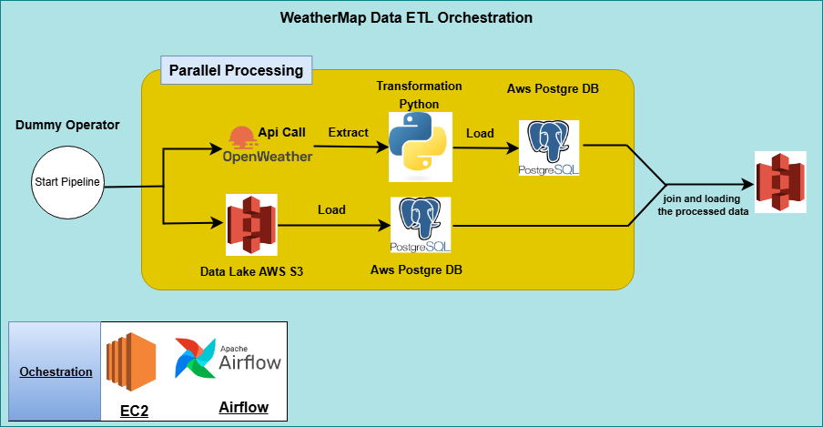

# Realtime Parallel Processing Using Amazon, Aws

## Overview

This project is a data engineering pipeline that fetches weather data for Houston from the OpenWeatherMap API, transforms it, and loads it into an AWS RDS PostgreSQL database. The pipeline is orchestrated using Apache Airflow, which allows for the scheduling and monitoring of data workflows. The project also includes steps to manage city data from an S3 bucket, enabling parallel processing of tasks.

## Architecture

## Technologies Used

- **Apache Airflow:** For orchestrating the ETL pipeline.
- **Python:** For scripting the transformation and loading processes.
- **PostgreSQL:** As the database to store weather and city data.
- **AWS S3:** For storing intermediate data files.
- **AWS EC2:** For hosting the Apache Airflow instance.
- **Pandas:** For data manipulation and transformation.

## Project Structure

The project consists of a single DAG (Directed Acyclic Graph) defined in Python. The DAG includes various tasks grouped into logical sections:

- **Extract:** Fetches weather data from the OpenWeatherMap API and city data from S3.
- **Transform:** Processes the raw data into a structured format.
- **Load:** Loads the transformed data into PostgreSQL.

## DAG Details

### DAG Name: weather_dag_2
- **Schedule Interval:** Daily
- **Start Date:** November 14, 2024
- **Retries:** 2
- **Retry Delay:** 2 minutes

### Task Breakdown
1. **Task Group:** '**group_a**'

   - **Create Tables:** Creates the necessary tables in PostgreSQL for city and weather data.
   - **Truncate Table:** Clears the city_look_up table before loading new data.
   - **Upload S3 to PostgreSQL:** Loads city data from an S3 bucket into the city_look_up table.
   - **Check API Readiness:** Uses an HTTP sensor to check if the OpenWeatherMap API is ready to respond.
   - **Extract Weather Data:** Fetches the current weather data for Houston using the OpenWeatherMap API.
   - **Transform and Load Weather Data:** Transforms the fetched weather data into a structured format and loads it into the weather_data table.
   - **Join Data Task:** Joins the weather data with the city data from PostgreSQL.

2. **Save Joined Data to S3:** Saves the joined data as a CSV file to an S3 bucket.

3. **Start and End Pipeline:** Dummy operators to mark the beginning and end of the pipeline.

## Functions

- **kelvin_to_fahrenheit:** Converts temperature from Kelvin to Fahrenheit.
- **transform_load_data:** Transforms the fetched weather data into a structured format and saves it as a CSV file.
- **load_weather:** Loads the weather data from a CSV file into PostgreSQL.
- **save_joined_data_s3:** Saves the joined weather and city data to S3 as a CSV file.

## Conclusion

This project demonstrates how to build a robust data processing pipeline using Apache Airflow, integrating various data sources and managing data transformations. The parallel processing capabilities of Airflow allow for efficient task execution, making it suitable for handling large datasets in real-time applications.

Feel free to contribute to this project or use it as a template for your own data engineering workflows!
